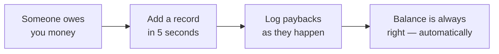

<!--suppress ALL -->

  

<h1 align="center">DebtTracker</h1>

  <b>The app that remembers who owes whom — so your friendships don't have to.</b> 
  «Поверну на наступному тижні» — сказано у 2019. Ми досі пам'ятаємо.

  <a href="https://bobadronov.github.io/debt-tracker/" target="_blank" rel="noopener noreferrer"><b>▶ Try it now in your browser</b></a> · nothing to install

  
  
  
  

  <b>English</b> ·
  <a href="README.uk.md" target="_blank" rel="noopener noreferrer">Українська</a> ·
  <a href="README.de.md" target="_blank" rel="noopener noreferrer">Deutsch</a> ·
  <a href="README.es.md" target="_blank" rel="noopener noreferrer">Español</a> ·
  <a href="README.fr.md" target="_blank" rel="noopener noreferrer">Français</a> ·
  <a href="README.it.md" target="_blank" rel="noopener noreferrer">Italiano</a> ·
  <a href="README.nl.md" target="_blank" rel="noopener noreferrer">Nederlands</a> ·
  <a href="README.pl.md" target="_blank" rel="noopener noreferrer">Polski</a> ·
  <a href="README.pt.md" target="_blank" rel="noopener noreferrer">Português</a> ·
  <a href="README.cs.md" target="_blank" rel="noopener noreferrer">Čeština</a>

---

## 💸 The problem

You lent your friend money for lunch. They lent you money for a taxi. Your
brother owes you from last month, and you owe your neighbour for the drill.
Somewhere in that mess is the truth, and it is not in your head.

**DebtTracker keeps the score so nobody has to pretend they forgot.**

---

## ✨ Why you'll like it

### 🔀 Two lists, never mixed up
**"They owe me"** and **"I owe them"** live side by side, each with its own
running total. The same person can be in both — we never quietly net one
against the other. Your accountant might cry. Your friendships won't.

### 📴 Offline-first, cloud optional
Every entry saves to your phone **instantly**, plane mode or not. Want it on
your tablet and laptop too? Sign in and it syncs in real time. Don't want an
account? Then don't have one. The app doesn't care.

### 🧾 Every loan and payback, tracked
Log the €50 you lent, then the €20 they paid back, then the other €30. The
balance updates itself. Colour-coded, so you know at a glance who's winning.

### 📸 Add people with a QR code
Point the camera at a friend's DebtTracker QR and their name, phone and photo
fill themselves in. Typing contact details is *so* 2010.

### 🔒 Locked down
Fingerprint, face unlock or PIN — every time the app opens. What you lend is
nobody else's business.

### 📊 Stats that sting (a little)
Totals in both directions, your top debtors and creditors, and a 6-month
trend chart. Great for New Year's resolutions.

### 📤 Export to CSV or PDF
Filter by direction and date range, hit export, done. For taxes, for
receipts, or for that one friend who insists "that never happened."

### 🏠 Home-screen widget
Both running totals, right on your Android home screen. The number is either
motivating or terrifying. Your call.

### 🌍 Speaks your language
System · Українська · English · Deutsch · Español · Français · Italiano ·
Nederlands · Polski · Português · Čeština — switch instantly, no restart.

Plus search, sort, filters, swipe-to-delete, satisfying little sounds, and
keyboard shortcuts on Desktop for the power users.

---

## 🚀 How it works

---

## 📥 Get it

| Where                                            | Link                                                                                |
|--------------------------------------------------|-------------------------------------------------------------------------------------|
| 🌐 **Web** — nothing to install (free account)   | <b><a href="https://bobadronov.github.io/debt-tracker/" target="_blank" rel="noopener noreferrer">bobadronov.github.io/debt-tracker</a></b> |
| 🤖 **Android** | <a href="https://play.google.com/store/apps/details?id=org.bigblackowl.debttracker.androidApp" target="_blank" rel="noopener noreferrer">Google Play</a>        |
| 🖥️ **Windows** (MSI)                            | <a href="https://github.com/bobadronov/debt-tracker/releases/latest" target="_blank" rel="noopener noreferrer">Latest release</a>        |
| 🐧 **Linux** (DEB)                               | <a href="https://github.com/bobadronov/debt-tracker/releases/latest" target="_blank" rel="noopener noreferrer">Latest release</a>        |
| 🍎 **macOS** (DMG, Intel + Apple Silicon)         | <a href="https://github.com/bobadronov/debt-tracker/releases/latest" target="_blank" rel="noopener noreferrer">Latest release</a>        |
| 🍏 **iOS**                                       | Build from source                                                                   |

---

## 🔐 Your data, your rules

No ads. No trackers. No analytics SDKs. Nothing leaves your device unless
**you** create an account for sync — and even then it's just your data, only
yours, encrypted in transit. Delete everything from Settings whenever you
like.

---

## 💬 Ideas & bugs

Something missing? Something broken? **Settings → Send feedback** opens a short
form that lands straight in the developer's inbox — screenshots welcome.

---

Made for people who like their friendships <i>and</i> their money.

