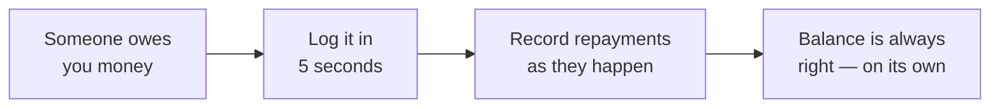

  

<h1 align="center">DebtTracker</h1>

  <b>The app that remembers who owes whom — so your friendships don't have to.</b> 
  "I'll pay you back next week" — said in 2019. We still remember.

  <a href="https://bobadronov.github.io/debt-tracker/" target="_blank" rel="noopener noreferrer"><b>▶ Try it right in your browser</b></a> · nothing to install

  
  
  
  

  <b>English</b> ·
  <a href="README.uk.md" target="_blank" rel="noopener noreferrer">Українська</a> ·
  <a href="README.de.md" target="_blank" rel="noopener noreferrer">Deutsch</a> ·
  <a href="README.es.md" target="_blank" rel="noopener noreferrer">Español</a> ·
  <a href="README.fr.md" target="_blank" rel="noopener noreferrer">Français</a> ·
  <a href="README.it.md" target="_blank" rel="noopener noreferrer">Italiano</a> ·
  <a href="README.nl.md" target="_blank" rel="noopener noreferrer">Nederlands</a> ·
  <a href="README.pl.md" target="_blank" rel="noopener noreferrer">Polski</a> ·
  <a href="README.pt.md" target="_blank" rel="noopener noreferrer">Português</a> ·
  <a href="README.cs.md" target="_blank" rel="noopener noreferrer">Čeština</a>

---

## 💸 The problem

You lent a friend lunch money. They covered your taxi. Your brother still
owes you from last month, and you owe your neighbor for the drill. The
truth is in there somewhere — definitely not in your head.

**DebtTracker keeps the score, so nobody has to pretend to forget.**

---

## ✨ Why you'll like it

### 🔀 Two lists that never get mixed up
**"Owed to me"** and **"I owe"** live side by side, each with its own running
total. One person can be in both — we never quietly net one against the
other. Your accountant might cry. Your friendship won't.

### 📴 Offline first, cloud optional
Every entry saves to your phone **instantly**, airplane mode or not. Want
the same data on your tablet and laptop? Sign in and it syncs in real time.
Don't want an account? Don't make one. The app doesn't care.

### 🧾 Every loan and repayment, tracked
Log the €50 you lent, then the €20 that came back, then another €30. The
balance updates itself. Color-coded, so you always know who's ahead.

### 📸 Add people via QR code
Point your camera at a friend's QR code in DebtTracker and their name, phone
number, and photo fill in on their own. Typing contacts in by hand is *so*
2010s.

### 🔒 Locked down
Fingerprint, face unlock, or a PIN, every time you open the app. Who owes
you what is nobody else's business.

### 📊 Stats that sting a little
Running totals in both directions, your top debtors and creditors, and a
6-month trend chart. Perfect for New Year's resolutions.

### 📤 Export to CSV or PDF
Filter by direction and date, hit export, done. For taxes, for receipts, or
for that one friend who insists "that never happened."

### 🏠 Home-screen widget
Both running totals, right on your Android home screen. That number either
motivates you or terrifies you. Your call.

### 🌍 Speaks your language
System · Українська · English · Deutsch · Español · Français · Italiano ·
Nederlands · Polski · Português · Čeština — instant switching, no restart.

Plus search, sort, filters, swipe-to-delete, pleasant sounds, and keyboard
shortcuts on Desktop for power users.

---

## 🚀 How it works

---

## 📥 Download

| Where | Link |
|---|---|
| 🌐 **Web** — nothing to install (free account) | <b><a href="https://bobadronov.github.io/debt-tracker/" target="_blank" rel="noopener noreferrer">bobadronov.github.io/debt-tracker</a></b> |
| 🤖 **Android** | <a href="https://play.google.com/store/apps/details?id=org.bigblackowl.debttracker.androidApp" target="_blank" rel="noopener noreferrer">Google Play</a> |
| 🖥️ **Windows** (MSI) | <a href="https://github.com/bobadronov/debt-tracker/releases/latest" target="_blank" rel="noopener noreferrer">Latest release</a> |
| 🐧 **Linux** (DEB) | <a href="https://github.com/bobadronov/debt-tracker/releases/latest" target="_blank" rel="noopener noreferrer">Latest release</a> |
| 🍎 **macOS** (DMG, Intel + Apple Silicon) | <a href="https://github.com/bobadronov/debt-tracker/releases/latest" target="_blank" rel="noopener noreferrer">Latest release</a> |
| 🍏 **iOS** | Build from source |

---

## 🔐 Your data, your rules

No ads. No trackers. No analytics SDKs. Nothing leaves your device until
**you** create an account for sync — and even then it's only your data,
yours alone, encrypted in transit. Delete everything, anytime, from
settings.

---

## 💬 Ideas & bugs

Missing something? Something broken? **Settings → Send feedback** opens a
short form that goes straight to the developer — screenshots welcome.

---

Made for people who love their friendships <i>and</i> their money.

