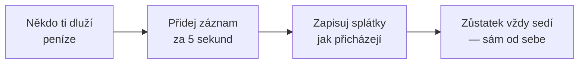

  

<h1 align="center">DebtTracker</h1>

  <b>Aplikace, která si pamatuje, kdo komu dluží — aby to nemuselo dělat vaše přátelství.</b> 
  „Vrátím ti to příští týden" — řečeno v roce 2019. My si to pořád pamatujeme.

  <a href="https://bobadronov.github.io/debt-tracker/" target="_blank" rel="noopener noreferrer"><b>▶ Vyzkoušejte to hned v prohlížeči</b></a> · nic k instalaci

  
  
  
  

  <a href="README.MD">English</a> ·
  <a href="README.uk.md">Українська</a> ·
  <a href="README.de.md">Deutsch</a> ·
  <a href="README.es.md">Español</a> ·
  <a href="README.fr.md">Français</a> ·
  <a href="README.it.md">Italiano</a> ·
  <a href="README.nl.md">Nederlands</a> ·
  <a href="README.pl.md">Polski</a> ·
  <a href="README.pt.md">Português</a> ·
  <b>Čeština</b>

---

## 💸 Problém

Půjčil jsi kamarádovi na oběd. On tobě na taxíka. Bratr ti dluží z minulého
měsíce a ty dlužíš sousedovi za vrtačku. Někde v tom zmatku je pravda — a
rozhodně není ve tvé hlavě.

**DebtTracker vede skóre, aby nikdo nemusel předstírat, že zapomněl.**

---

## ✨ Proč se ti to bude líbit

### 🔀 Dva seznamy, nikdy popletené
**„Dluží mně"** a **„Dlužím já"** jsou vedle sebe, každý s vlastním průběžným
součtem. Stejná osoba může být v obou — nikdy je potají nezapočítáváme proti
sobě. Tvůj účetní možná zapláče. Tvá přátelství ne.

### 📴 Nejdřív offline, cloud volitelně
Každý záznam se uloží do telefonu **okamžitě**, ať jsi v režimu letadlo nebo
ne. Chceš to i na tabletu a notebooku? Přihlas se a všechno se synchronizuje
v reálném čase. Nechceš účet? Tak ho neměj. Aplikaci je to jedno.

### 🧾 Každá půjčka i splátka pod kontrolou
Zapiš 50 € půjčených, pak 20 € vrácených, pak dalších 30 €. Zůstatek se
aktualizuje sám. Barevně odlišený, abys hned viděl, kdo vede.

### 📸 Přidávej lidi pomocí QR kódu
Namiř foťák na kamarádův QR kód v DebtTrackeru — jeho jméno, číslo i fotka se
vyplní samy. Vyťukávat kontaktní údaje je *hodně* rok 2010.

### 🔒 Pod zámkem
Otisk prstu, odemčení obličejem nebo PIN — pokaždé, když aplikaci otevřeš. Co
komu půjčuješ, do toho nikomu nic není.

### 📊 Statistiky, které trochu bodnou
Součty v obou směrech, tví největší dlužníci a věřitelé a graf trendu za 6
měsíců. Ideální na novoroční předsevzetí.

### 📤 Export do CSV nebo PDF
Vyfiltruj podle směru a rozsahu dat, klikni na export, hotovo. Pro finanční
úřad, na účtenky, nebo pro toho jednoho kamaráda, který tvrdí, že „se to
nikdy nestalo".

### 🏠 Widget na domovské obrazovce
Oba průběžné součty přímo na domovské obrazovce Androidu. To číslo buď
motivuje, nebo děsí. Je to na tobě.

### 🌍 Mluví tvým jazykem
Systémový · Українська · English · Deutsch · Español · Français · Italiano ·
Nederlands · Polski · Português · Čeština — přepnutí okamžité, bez
restartu.

K tomu vyhledávání, řazení, filtry, přejetí pro smazání, příjemné zvuky a
klávesové zkratky na počítači pro pokročilé.

---

## 🚀 Jak to funguje

---

## 📥 Stáhnout

| Kde | Odkaz |
|---|---|
| 🌐 **Web** — není co instalovat (účet zdarma) | **[bobadronov.github.io/debt-tracker](https://bobadronov.github.io/debt-tracker/)** |
| 🤖 **Android** | [Google Play](https://play.google.com/store/apps/details?id=org.bigblackowl.debttracker.androidApp) |
| 🖥️ **Windows** (MSI) | [Nejnovější verze](https://github.com/bobadronov/debt-tracker/releases/latest) |
| 🐧 **Linux** (DEB) | [Nejnovější verze](https://github.com/bobadronov/debt-tracker/releases/latest) |
| 🍎 **macOS** (DMG, Intel + Apple Silicon) | [Nejnovější verze](https://github.com/bobadronov/debt-tracker/releases/latest) |
| 🍏 **iOS** | Sestavit ze zdrojového kódu |

---

## 🔐 Tvá data, tvá pravidla

Žádné reklamy. Žádné trackery. Žádné analytické SDK. Nic neopustí tvé
zařízení, dokud si **ty** nevytvoříš účet pro synchronizaci — a i pak jsou to
jen tvá data, výhradně tvá, šifrovaná při přenosu. Smaž všechno v Nastavení,
kdykoli budeš chtít.

---

## 💬 Nápady a chyby

Něco chybí? Něco nefunguje? **Nastavení → Odeslat zpětnou vazbu** otevře krátký
formulář, který zamíří rovnou do schránky vývojáře — snímky obrazovky vítány.

---

Vytvořeno pro lidi, kteří mají rádi svá přátelství <i>i</i> své peníze.

