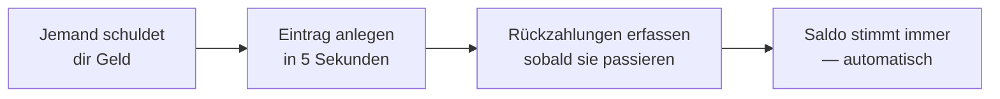

  

<h1 align="center">DebtTracker</h1>

  <b>Die App, die sich merkt, wer wem was schuldet — damit deine Freundschaften es nicht müssen.</b> 
  „Ich zahl's dir nächste Woche zurück" — gesagt 2019. Wir erinnern uns noch.

  <a href="https://bobadronov.github.io/debt-tracker/"><b>▶ Jetzt direkt im Browser testen</b></a> · nichts zu installieren

  
  
  
  

  <a href="README.MD">English</a> ·
  <a href="README.uk.md">Українська</a> ·
  <b>Deutsch</b> ·
  <a href="README.es.md">Español</a> ·
  <a href="README.fr.md">Français</a> ·
  <a href="README.it.md">Italiano</a> ·
  <a href="README.nl.md">Nederlands</a> ·
  <a href="README.pl.md">Polski</a> ·
  <a href="README.pt.md">Português</a> ·
  <a href="README.cs.md">Čeština</a>

---

## 💸 Das Problem

Du hast einem Freund das Mittagessen geliehen. Er dir die Taxifahrt. Dein
Bruder schuldet dir was von letztem Monat, und du dem Nachbarn für die
Bohrmaschine. Irgendwo in diesem Chaos steckt die Wahrheit — und die ist
nicht in deinem Kopf.

**DebtTracker führt Buch, damit niemand so tun muss, als hätte er's vergessen.**

---

## ✨ Warum du es mögen wirst

### 🔀 Zwei Listen, nie durcheinander
**„Schulden mir"** und **„Ich schulde"** stehen nebeneinander, jede mit
eigener laufender Summe. Dieselbe Person kann in beiden auftauchen — wir
verrechnen nie heimlich das eine gegen das andere. Dein Buchhalter weint
vielleicht. Deine Freundschaften nicht.

### 📴 Offline zuerst, Cloud optional
Jeder Eintrag landet **sofort** auf deinem Handy, Flugmodus hin oder her.
Auch auf Tablet und Laptop? Anmelden, und alles synchronisiert sich in
Echtzeit. Kein Konto gewünscht? Dann eben nicht. Der App ist es egal.

### 🧾 Jeder Kredit und jede Rückzahlung erfasst
Trag die 50 € ein, die du verliehen hast, dann die 20 € zurück, dann die
restlichen 30 €. Der Saldo aktualisiert sich selbst. Farblich codiert — ein
Blick genügt, um zu sehen, wer vorne liegt.

### 📸 Kontakte per QR-Code hinzufügen
Kamera auf den DebtTracker-QR-Code eines Freundes halten — Name, Nummer und
Foto füllen sich von selbst aus. Kontaktdaten abtippen ist *sowas* von 2010.

### 🔒 Abgeschlossen
Fingerabdruck, Gesichtsentsperrung oder PIN — jedes Mal beim Öffnen. Was du
verleihst, geht sonst niemanden was an.

### 📊 Statistiken, die (ein bisschen) wehtun
Summen in beide Richtungen, deine größten Schuldner und Gläubiger und ein
6-Monats-Trenddiagramm. Perfekt für Neujahrsvorsätze.

### 📤 Export als CSV oder PDF
Nach Richtung und Zeitraum filtern, exportieren, fertig. Fürs Finanzamt, für
Belege oder für den einen Freund, der beharrt: „Das war nie so."

### 🏠 Homescreen-Widget
Beide laufenden Summen direkt auf deinem Android-Homescreen. Die Zahl ist
entweder motivierend oder beängstigend. Deine Entscheidung.

### 🌍 Spricht deine Sprache
System · Українська · English · Deutsch · Español · Français · Italiano ·
Nederlands · Polski · Português · Čeština — sofort umschaltbar, ohne
Neustart.

Dazu Suche, Sortierung, Filter, Wischen zum Löschen, angenehme kleine
Sounds und Tastenkürzel auf dem Desktop für die Profis.

---

## 🚀 So funktioniert's

---

## 📥 Herunterladen

| Wo | Link |
|---|---|
| 🌐 **Web** — nichts zu installieren (kostenloses Konto) | **[bobadronov.github.io/debt-tracker](https://bobadronov.github.io/debt-tracker/)** |
| 🤖 **Android** (APK) | [Neuestes Release](https://github.com/bobadronov/debt-tracker/releases/latest) |
| 🖥️ **Windows** (MSI) | [Neuestes Release](https://github.com/bobadronov/debt-tracker/releases/latest) |
| 🐧 **Linux** (DEB) | [Neuestes Release](https://github.com/bobadronov/debt-tracker/releases/latest) |
| 🍏 **iOS** | Aus dem Quellcode bauen |

---

## 🔐 Deine Daten, deine Regeln

Keine Werbung. Kein Tracking. Keine Analytics-SDKs. Nichts verlässt dein
Gerät, es sei denn, **du** legst ein Konto für die Synchronisierung an — und
selbst dann sind es nur deine Daten, nur deine, verschlüsselt übertragen.
Lösch alles jederzeit in den Einstellungen.

---

## 💬 Ideen & Fehler

Fehlt etwas? Hakt etwas? **Einstellungen → Feedback senden** öffnet ein kurzes
Formular, das direkt im Postfach des Entwicklers landet — Screenshots willkommen.

---

Gemacht für Menschen, die ihre Freundschaften <i>und</i> ihr Geld mögen.

