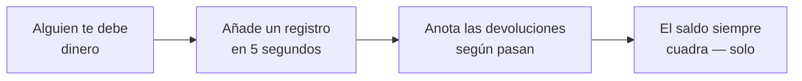

  

<h1 align="center">DebtTracker</h1>

  <b>La app que recuerda quién le debe a quién — para que tus amistades no tengan que hacerlo.</b> 
  «Te lo devuelvo la semana que viene» — dicho en 2019. Nosotros aún lo recordamos.

  <a href="https://bobadronov.github.io/debt-tracker/" target="_blank" rel="noopener noreferrer"><b>▶ Pruébala ahora en tu navegador</b></a> · nada que instalar

  
  
  
  

  <a href="README.MD">English</a> ·
  <a href="README.uk.md">Українська</a> ·
  <a href="README.de.md">Deutsch</a> ·
  <b>Español</b> ·
  <a href="README.fr.md">Français</a> ·
  <a href="README.it.md">Italiano</a> ·
  <a href="README.nl.md">Nederlands</a> ·
  <a href="README.pl.md">Polski</a> ·
  <a href="README.pt.md">Português</a> ·
  <a href="README.cs.md">Čeština</a>

---

## 💸 El problema

Le prestaste a un amigo para el almuerzo. Él te prestó para el taxi. Tu
hermano te debe del mes pasado y tú le debes al vecino por el taladro. En
algún punto de ese lío está la verdad, y no está en tu cabeza.

**DebtTracker lleva la cuenta para que nadie tenga que fingir que se olvidó.**

---

## ✨ Por qué te va a gustar

### 🔀 Dos listas, nunca mezcladas
**«Me deben»** y **«Yo debo»** van una al lado de la otra, cada una con su
propio total. La misma persona puede estar en ambas — nunca compensamos una
con la otra a escondidas. Puede que tu contable llore. Tus amistades no.

### 📴 Primero sin conexión, la nube es opcional
Cada registro se guarda en tu teléfono **al instante**, con o sin modo
avión. ¿Lo quieres también en la tablet y el portátil? Inicia sesión y se
sincroniza en tiempo real. ¿No quieres cuenta? Pues no la tengas. A la app le
da igual.

### 🧾 Cada préstamo y cada devolución, registrados
Anota los 50 € que prestaste, luego los 20 € que te devolvieron, luego los
otros 30 €. El saldo se actualiza solo. Con colores, para ver de un vistazo
quién va ganando.

### 📸 Añade gente con un código QR
Apunta la cámara al QR de DebtTracker de un amigo y su nombre, teléfono y
foto se rellenan solos. Teclear datos de contacto es *muy* de 2010.

### 🔒 Bajo llave
Huella, desbloqueo facial o PIN — cada vez que abres la app. Lo que prestas
no es asunto de nadie más.

### 📊 Estadísticas que escuecen (un poco)
Totales en ambos sentidos, tus mayores deudores y acreedores, y un gráfico
de tendencia de 6 meses. Ideal para los propósitos de Año Nuevo.

### 📤 Exporta a CSV o PDF
Filtra por sentido y rango de fechas, pulsa exportar, listo. Para Hacienda,
para recibos o para ese amigo que insiste en que «eso nunca pasó».

### 🏠 Widget en la pantalla de inicio
Ambos totales, directamente en tu pantalla de inicio de Android. El número
motiva o aterra. Tú decides.

### 🌍 Habla tu idioma
Sistema · Українська · English · Deutsch · Español · Français · Italiano ·
Nederlands · Polski · Português · Čeština — cambio instantáneo, sin
reiniciar.

Además, búsqueda, orden, filtros, deslizar para borrar, pequeños sonidos
agradables y atajos de teclado en el escritorio para los más avanzados.

---

## 🚀 Cómo funciona

---

## 📥 Consíguela

| Dónde | Enlace |
|---|---|
| 🌐 **Web** — nada que instalar (cuenta gratuita) | **[bobadronov.github.io/debt-tracker](https://bobadronov.github.io/debt-tracker/)** |
| 🤖 **Android** | [Google Play](https://play.google.com/store/apps/details?id=org.bigblackowl.debttracker.androidApp) |
| 🖥️ **Windows** (MSI) | [Última versión](https://github.com/bobadronov/debt-tracker/releases/latest) |
| 🐧 **Linux** (DEB) | [Última versión](https://github.com/bobadronov/debt-tracker/releases/latest) |
| 🍎 **macOS** (DMG, Intel + Apple Silicon) | [Última versión](https://github.com/bobadronov/debt-tracker/releases/latest) |
| 🍏 **iOS** | Compilar desde el código |

---

## 🔐 Tus datos, tus reglas

Sin anuncios. Sin rastreadores. Sin SDK de analíticas. Nada sale de tu
dispositivo salvo que **tú** crees una cuenta para sincronizar — e incluso
entonces son solo tus datos, solo tuyos, cifrados en tránsito. Borra todo
desde Ajustes cuando quieras.

---

## 💬 Ideas y errores

¿Falta algo? ¿Algo no funciona? **Ajustes → Enviar comentarios** abre un
formulario breve que llega directo a la bandeja del desarrollador — se
agradecen capturas de pantalla.

---

Hecho para gente que aprecia sus amistades <i>y</i> su dinero.

