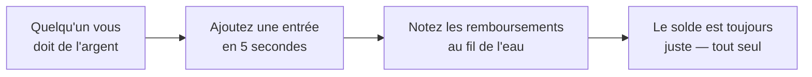

  

<h1 align="center">DebtTracker</h1>

  <b>L'appli qui se souvient de qui doit quoi à qui — pour que vos amitiés n'aient pas à le faire.</b> 
  « Je te rembourse la semaine prochaine » — dit en 2019. Nous, on s'en souvient encore.

  <a href="https://bobadronov.github.io/debt-tracker/" target="_blank" rel="noopener noreferrer"><b>▶ Essayez-la maintenant dans votre navigateur</b></a> · rien à installer

  
  
  
  

  <a href="README.MD" target="_blank" rel="noopener noreferrer">English</a> ·
  <a href="README.uk.md" target="_blank" rel="noopener noreferrer">Українська</a> ·
  <a href="README.de.md" target="_blank" rel="noopener noreferrer">Deutsch</a> ·
  <a href="README.es.md" target="_blank" rel="noopener noreferrer">Español</a> ·
  <b>Français</b> ·
  <a href="README.it.md" target="_blank" rel="noopener noreferrer">Italiano</a> ·
  <a href="README.nl.md" target="_blank" rel="noopener noreferrer">Nederlands</a> ·
  <a href="README.pl.md" target="_blank" rel="noopener noreferrer">Polski</a> ·
  <a href="README.pt.md" target="_blank" rel="noopener noreferrer">Português</a> ·
  <a href="README.cs.md" target="_blank" rel="noopener noreferrer">Čeština</a>

---

## 💸 Le problème

Vous avez prêté le déjeuner à un ami. Il vous a prêté le taxi. Votre frère
vous doit de l'argent depuis le mois dernier, et vous devez au voisin pour
la perceuse. Quelque part dans ce fatras se cache la vérité — et elle n'est
pas dans votre tête.

**DebtTracker tient les comptes pour que personne n'ait à faire semblant d'avoir oublié.**

---

## ✨ Pourquoi vous allez l'adorer

### 🔀 Deux listes, jamais mélangées
**« On me doit »** et **« Je dois »** cohabitent, chacune avec son propre
total courant. La même personne peut figurer dans les deux — on ne compense
jamais l'une par l'autre en douce. Votre comptable pleurera peut-être. Pas
vos amitiés.

### 📴 Hors ligne d'abord, cloud en option
Chaque saisie est enregistrée sur votre téléphone **instantanément**, mode
avion ou pas. Vous la voulez aussi sur la tablette et le portable ?
Connectez-vous et tout se synchronise en temps réel. Pas envie de compte ?
Alors n'en créez pas. L'appli s'en moque.

### 🧾 Chaque prêt et chaque remboursement, suivis
Notez les 50 € prêtés, puis les 20 € rendus, puis les 30 € restants. Le
solde se met à jour tout seul. Codé par couleur, pour voir d'un coup d'œil
qui mène.

### 📸 Ajoutez des gens avec un QR code
Pointez l'appareil photo vers le QR DebtTracker d'un ami : son nom, son
numéro et sa photo se remplissent tout seuls. Taper des coordonnées, c'est
*tellement* 2010.

### 🔒 Sous clé
Empreinte, reconnaissance faciale ou code PIN — à chaque ouverture. Ce que
vous prêtez ne regarde personne d'autre.

### 📊 Des stats qui piquent (un peu)
Totaux dans les deux sens, vos plus gros débiteurs et créanciers, et un
graphique de tendance sur 6 mois. Parfait pour les bonnes résolutions.

### 📤 Export en CSV ou PDF
Filtrez par sens et par période, appuyez sur exporter, c'est fait. Pour le
fisc, pour les justificatifs, ou pour cet ami qui jure que « ça n'est jamais
arrivé ».

### 🏠 Widget sur l'écran d'accueil
Les deux totaux courants, directement sur votre écran d'accueil Android. Le
chiffre est soit motivant, soit terrifiant. À vous de voir.

### 🌍 Parle votre langue
Système · Українська · English · Deutsch · Español · Français · Italiano ·
Nederlands · Polski · Português · Čeština — bascule instantanée, sans
redémarrage.

Plus la recherche, le tri, les filtres, le balayage pour supprimer, de
petits sons agréables et des raccourcis clavier sur ordinateur pour les
experts.

---

## 🚀 Comment ça marche

---

## 📥 Téléchargez

| Où | Lien |
|---|---|
| 🌐 **Web** — rien à installer (compte gratuit) | <b><a href="https://bobadronov.github.io/debt-tracker/" target="_blank" rel="noopener noreferrer">bobadronov.github.io/debt-tracker</a></b> |
| 🤖 **Android** | <a href="https://play.google.com/store/apps/details?id=org.bigblackowl.debttracker.androidApp" target="_blank" rel="noopener noreferrer">Google Play</a> |
| 🖥️ **Windows** (MSI) | <a href="https://github.com/bobadronov/debt-tracker/releases/latest" target="_blank" rel="noopener noreferrer">Dernière version</a> |
| 🐧 **Linux** (DEB) | <a href="https://github.com/bobadronov/debt-tracker/releases/latest" target="_blank" rel="noopener noreferrer">Dernière version</a> |
| 🍎 **macOS** (DMG, Intel + Apple Silicon) | <a href="https://github.com/bobadronov/debt-tracker/releases/latest" target="_blank" rel="noopener noreferrer">Dernière version</a> |
| 🍏 **iOS** | Compiler depuis les sources |

---

## 🔐 Vos données, vos règles

Pas de pub. Pas de traceurs. Pas de SDK d'analytics. Rien ne quitte votre
appareil, sauf si **vous** créez un compte pour la synchronisation — et même
là, ce ne sont que vos données, rien que les vôtres, chiffrées en transit.
Supprimez tout depuis les Réglages quand vous voulez.

---

## 💬 Idées et bugs

Il manque quelque chose ? Quelque chose est cassé ? **Paramètres → Envoyer un
commentaire** ouvre un court formulaire qui arrive directement dans la boîte du
développeur — captures d'écran bienvenues.

---

Fait pour les gens qui tiennent à leurs amitiés <i>et</i> à leur argent.

