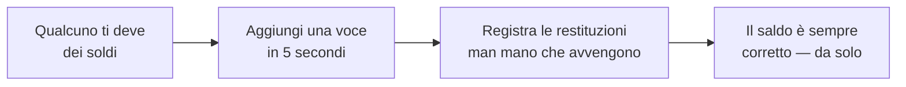

  

<h1 align="center">DebtTracker</h1>

  <b>L'app che ricorda chi deve cosa a chi — così non devono farlo le tue amicizie.</b> 
  «Te li ridò la settimana prossima» — detto nel 2019. Noi ce lo ricordiamo ancora.

  <a href="https://bobadronov.github.io/debt-tracker/"><b>▶ Provala subito nel browser</b></a> · niente da installare

  
  
  
  

  <a href="README.MD">English</a> ·
  <a href="README.uk.md">Українська</a> ·
  <a href="README.de.md">Deutsch</a> ·
  <a href="README.es.md">Español</a> ·
  <a href="README.fr.md">Français</a> ·
  <b>Italiano</b> ·
  <a href="README.nl.md">Nederlands</a> ·
  <a href="README.pl.md">Polski</a> ·
  <a href="README.pt.md">Português</a> ·
  <a href="README.cs.md">Čeština</a>

---

## 💸 Il problema

Hai prestato a un amico i soldi del pranzo. Lui ha prestato a te quelli del
taxi. Tuo fratello ti deve dei soldi dal mese scorso e tu li devi al vicino
per il trapano. Da qualche parte in questo caos c'è la verità — e non è
nella tua testa.

**DebtTracker tiene il conto, così nessuno deve fingere di aver dimenticato.**

---

## ✨ Perché ti piacerà

### 🔀 Due elenchi, mai confusi
**«Mi devono»** e **«Devo io»** stanno fianco a fianco, ciascuno con il
proprio totale corrente. La stessa persona può stare in entrambi — non
compensiamo mai di nascosto l'uno con l'altro. Il tuo commercialista magari
piange. Le tue amicizie no.

### 📴 Prima offline, il cloud è facoltativo
Ogni voce viene salvata sul telefono **all'istante**, modalità aereo o no.
La vuoi anche su tablet e portatile? Accedi e si sincronizza in tempo reale.
Non vuoi un account? E allora non averlo. All'app non importa.

### 🧾 Ogni prestito e ogni restituzione, tracciati
Segna i 50 € prestati, poi i 20 € restituiti, poi gli altri 30 €. Il saldo
si aggiorna da solo. Con i colori, per capire a colpo d'occhio chi è in
vantaggio.

### 📸 Aggiungi persone con un codice QR
Punta la fotocamera sul QR DebtTracker di un amico: nome, numero e foto si
compilano da soli. Digitare i contatti è *così* 2010.

### 🔒 Sotto chiave
Impronta, sblocco col volto o PIN — ogni volta che apri l'app. Quello che
presti non riguarda nessun altro.

### 📊 Statistiche che pungono (un po')
Totali in entrambe le direzioni, i tuoi maggiori debitori e creditori e un
grafico dell'andamento a 6 mesi. Perfetto per i propositi di Capodanno.

### 📤 Esporta in CSV o PDF
Filtra per direzione e intervallo di date, premi esporta, fatto. Per il
fisco, per le ricevute o per quell'amico che giura che «non è mai successo».

### 🏠 Widget nella schermata Home
Entrambi i totali correnti, direttamente sulla schermata Home di Android. Il
numero o motiva o terrorizza. Decidi tu.

### 🌍 Parla la tua lingua
Sistema · Українська · English · Deutsch · Español · Français · Italiano ·
Nederlands · Polski · Português · Čeština — cambio istantaneo, senza
riavvio.

In più ricerca, ordinamento, filtri, scorri per eliminare, piccoli suoni
piacevoli e scorciatoie da tastiera su desktop per i più esperti.

---

## 🚀 Come funziona

---

## 📥 Scaricala

| Dove | Link |
|---|---|
| 🌐 **Web** — niente da installare (account gratuito) | **[bobadronov.github.io/debt-tracker](https://bobadronov.github.io/debt-tracker/)** |
| 🤖 **Android** (APK) | [Ultima versione](https://github.com/bobadronov/debt-tracker/releases/latest) |
| 🖥️ **Windows** (MSI) | [Ultima versione](https://github.com/bobadronov/debt-tracker/releases/latest) |
| 🐧 **Linux** (DEB) | [Ultima versione](https://github.com/bobadronov/debt-tracker/releases/latest) |
| 🍏 **iOS** | Compila dai sorgenti |

---

## 🔐 I tuoi dati, le tue regole

Niente pubblicità. Niente tracker. Niente SDK di analytics. Nulla lascia il
tuo dispositivo, a meno che **tu** non crei un account per la
sincronizzazione — e anche allora sono solo i tuoi dati, solo tuoi, cifrati
in transito. Cancella tutto dalle Impostazioni quando vuoi.

---

## 💬 Idee e bug

Manca qualcosa? Qualcosa non funziona? **Impostazioni → Invia un feedback**
apre un breve modulo che arriva dritto nella casella dello sviluppatore —
screenshot benvenuti.

---

Fatta per chi tiene alle proprie amicizie <i>e</i> ai propri soldi.

