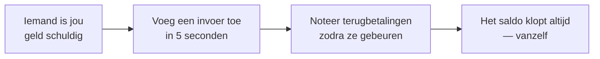

  

<h1 align="center">DebtTracker</h1>

  <b>De app die onthoudt wie wie wat schuldig is — zodat je vriendschappen dat niet hoeven.</b> 
  „Ik betaal je volgende week terug" — gezegd in 2019. Wij weten het nog.

  <a href="https://bobadronov.github.io/debt-tracker/" target="_blank" rel="noopener noreferrer"><b>▶ Probeer het nu in je browser</b></a> · niets te installeren

  
  
  
  

  <a href="README.MD" target="_blank" rel="noopener noreferrer">English</a> ·
  <a href="README.uk.md" target="_blank" rel="noopener noreferrer">Українська</a> ·
  <a href="README.de.md" target="_blank" rel="noopener noreferrer">Deutsch</a> ·
  <a href="README.es.md" target="_blank" rel="noopener noreferrer">Español</a> ·
  <a href="README.fr.md" target="_blank" rel="noopener noreferrer">Français</a> ·
  <a href="README.it.md" target="_blank" rel="noopener noreferrer">Italiano</a> ·
  <b>Nederlands</b> ·
  <a href="README.pl.md" target="_blank" rel="noopener noreferrer">Polski</a> ·
  <a href="README.pt.md" target="_blank" rel="noopener noreferrer">Português</a> ·
  <a href="README.cs.md" target="_blank" rel="noopener noreferrer">Čeština</a>

---

## 💸 Het probleem

Je leende een vriend geld voor de lunch. Hij leende jou geld voor de taxi.
Je broer is je nog iets schuldig van vorige maand, en jij bent de buurman
iets schuldig voor de boormachine. Ergens in die chaos zit de waarheid — en
die zit niet in je hoofd.

**DebtTracker houdt de stand bij, zodat niemand hoeft te doen alsof hij het vergeten is.**

---

## ✨ Waarom je het leuk gaat vinden

### 🔀 Twee lijsten, nooit door elkaar
**„Zijn mij schuldig"** en **„Ik ben schuldig"** staan naast elkaar, elk met
een eigen lopend totaal. Dezelfde persoon kan in beide staan — we verrekenen
ze nooit stiekem met elkaar. Je boekhouder huilt misschien. Je
vriendschappen niet.

### 📴 Eerst offline, cloud optioneel
Elke invoer wordt **direct** op je telefoon opgeslagen, vliegtuigstand of
niet. Wil je het ook op je tablet en laptop? Log in en alles synchroniseert
in realtime. Geen account nodig? Neem er dan geen. De app maakt het niet uit.

### 🧾 Elke lening en terugbetaling, bijgehouden
Noteer de € 50 die je uitleende, dan de € 20 die is terugbetaald, dan de
resterende € 30. Het saldo werkt zichzelf bij. Met kleurcodes, zodat je in
één oogopslag ziet wie voorstaat.

### 📸 Voeg mensen toe met een QR-code
Richt de camera op de DebtTracker-QR van een vriend en zijn naam, nummer en
foto vullen zichzelf in. Contactgegevens intypen is *zó* 2010.

### 🔒 Op slot
Vingerafdruk, gezichtsontgrendeling of pincode — elke keer dat de app
opengaat. Wat je uitleent gaat niemand anders wat aan.

### 📊 Statistieken die (een beetje) prikken
Totalen in beide richtingen, je grootste debiteuren en crediteuren, en een
trendgrafiek van 6 maanden. Ideaal voor goede voornemens.

### 📤 Exporteer naar CSV of PDF
Filter op richting en datumbereik, druk op exporteren, klaar. Voor de
Belastingdienst, voor bonnetjes, of voor die ene vriend die volhoudt dat
„dat nooit is gebeurd".

### 🏠 Widget op je startscherm
Beide lopende totalen, direct op je Android-startscherm. Het getal is
motiverend of angstaanjagend. Aan jou de keuze.

### 🌍 Spreekt jouw taal
Systeem · Українська · English · Deutsch · Español · Français · Italiano ·
Nederlands · Polski · Português · Čeština — meteen wisselen, zonder
herstarten.

Plus zoeken, sorteren, filteren, vegen om te verwijderen, fijne kleine
geluidjes en sneltoetsen op desktop voor de powergebruikers.

---

## 🚀 Hoe het werkt

---

## 📥 Downloaden

| Waar | Link |
|---|---|
| 🌐 **Web** — niets te installeren (gratis account) | <b><a href="https://bobadronov.github.io/debt-tracker/" target="_blank" rel="noopener noreferrer">bobadronov.github.io/debt-tracker</a></b> |
| 🤖 **Android** | <a href="https://play.google.com/store/apps/details?id=org.bigblackowl.debttracker.androidApp" target="_blank" rel="noopener noreferrer">Google Play</a> |
| 🖥️ **Windows** (MSI) | <a href="https://github.com/bobadronov/debt-tracker/releases/latest" target="_blank" rel="noopener noreferrer">Nieuwste release</a> |
| 🐧 **Linux** (DEB) | <a href="https://github.com/bobadronov/debt-tracker/releases/latest" target="_blank" rel="noopener noreferrer">Nieuwste release</a> |
| 🍎 **macOS** (DMG, Intel + Apple Silicon) | <a href="https://github.com/bobadronov/debt-tracker/releases/latest" target="_blank" rel="noopener noreferrer">Nieuwste release</a> |
| 🍏 **iOS** | Bouwen vanaf de broncode |

---

## 🔐 Jouw gegevens, jouw regels

Geen advertenties. Geen trackers. Geen analytics-SDK's. Er verlaat niets je
apparaat, tenzij **jij** een account aanmaakt om te synchroniseren — en
zelfs dan zijn het alleen jouw gegevens, alleen van jou, versleuteld tijdens
verzending. Wis alles wanneer je maar wilt via Instellingen.

---

## 💬 Ideeën & bugs

Mist er iets? Werkt er iets niet? **Instellingen → Feedback sturen** opent een
kort formulier dat rechtstreeks in de inbox van de ontwikkelaar belandt —
screenshots welkom.

---

Gemaakt voor mensen die zowel om hun vriendschappen <i>als</i> om hun geld geven.

