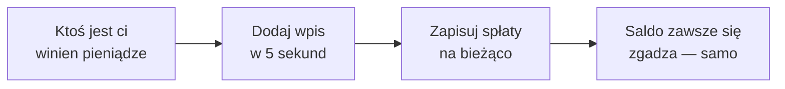

  

<h1 align="center">DebtTracker</h1>

  <b>Aplikacja, która pamięta, kto komu jest winien — żeby nie musiały tego robić twoje przyjaźnie.</b> 
  „Oddam ci w przyszłym tygodniu" — powiedziane w 2019. My wciąż pamiętamy.

  <a href="https://bobadronov.github.io/debt-tracker/" target="_blank" rel="noopener noreferrer"><b>▶ Wypróbuj teraz w przeglądarce</b></a> · nic do instalowania

  
  
  
  

  <a href="README.MD">English</a> ·
  <a href="README.uk.md">Українська</a> ·
  <a href="README.de.md">Deutsch</a> ·
  <a href="README.es.md">Español</a> ·
  <a href="README.fr.md">Français</a> ·
  <a href="README.it.md">Italiano</a> ·
  <a href="README.nl.md">Nederlands</a> ·
  <b>Polski</b> ·
  <a href="README.pt.md">Português</a> ·
  <a href="README.cs.md">Čeština</a>

---

## 💸 Problem

Pożyczyłeś koledze na obiad. On pożyczył tobie na taksówkę. Brat jest ci
winien z zeszłego miesiąca, a ty jesteś winien sąsiadowi za wiertarkę.
Gdzieś w tym bałaganie jest prawda — i na pewno nie ma jej w twojej głowie.

**DebtTracker prowadzi rachunki, żeby nikt nie musiał udawać, że zapomniał.**

---

## ✨ Dlaczego ci się spodoba

### 🔀 Dwie listy, nigdy pomylone
**„Są mi winni"** i **„Jestem winien"** stoją obok siebie, każda z własną
sumą bieżącą. Ta sama osoba może być na obu — nigdy po cichu nie
kompensujemy jednego drugim. Twój księgowy może i zapłacze. Twoje przyjaźnie
nie.

### 📴 Najpierw offline, chmura opcjonalnie
Każdy wpis zapisuje się na telefonie **natychmiast**, w trybie samolotowym
czy nie. Chcesz to też na tablecie i laptopie? Zaloguj się, a wszystko
zsynchronizuje się w czasie rzeczywistym. Nie chcesz konta? To go nie zakładaj.
Aplikacji jest wszystko jedno.

### 🧾 Każda pożyczka i spłata pod kontrolą
Zapisz 50 € pożyczone, potem 20 € oddane, potem kolejne 30 €. Saldo
aktualizuje się samo. Z kolorami, żeby na pierwszy rzut oka widzieć, kto
prowadzi.

### 📸 Dodawaj ludzi kodem QR
Skieruj aparat na kod QR DebtTracker znajomego — jego imię, numer i zdjęcie
uzupełnią się same. Wpisywanie danych kontaktowych jest *bardzo* 2010.

### 🔒 Pod kluczem
Odcisk palca, odblokowanie twarzą lub PIN — za każdym otwarciem aplikacji.
To, ile komu pożyczasz, to nie niczyja sprawa.

### 📊 Statystyki, które trochę bolą
Sumy w obie strony, twoi najwięksi dłużnicy i wierzyciele oraz wykres trendu
z 6 miesięcy. Idealne na postanowienia noworoczne.

### 📤 Eksport do CSV lub PDF
Filtruj po kierunku i zakresie dat, kliknij eksport, gotowe. Do urzędu
skarbowego, na paragony albo dla tego jednego znajomego, który upiera się,
że „to się nigdy nie wydarzyło".

### 🏠 Widżet na ekranie głównym
Obie sumy bieżące, prosto na ekranie głównym Androida. Liczba albo
motywuje, albo przeraża. Twój wybór.

### 🌍 Mówi w twoim języku
Systemowy · Українська · English · Deutsch · Español · Français · Italiano ·
Nederlands · Polski · Português · Čeština — przełączanie natychmiastowe, bez
restartu.

Do tego wyszukiwanie, sortowanie, filtry, przesunięcie, by usunąć, przyjemne
dźwięki i skróty klawiszowe na komputerze dla zaawansowanych.

---

## 🚀 Jak to działa

---

## 📥 Pobierz

| Gdzie | Link |
|---|---|
| 🌐 **Web** — nic do instalowania (darmowe konto) | **[bobadronov.github.io/debt-tracker](https://bobadronov.github.io/debt-tracker/)** |
| 🤖 **Android** | [Google Play](https://play.google.com/store/apps/details?id=org.bigblackowl.debttracker.androidApp) |
| 🖥️ **Windows** (MSI) | [Najnowsze wydanie](https://github.com/bobadronov/debt-tracker/releases/latest) |
| 🐧 **Linux** (DEB) | [Najnowsze wydanie](https://github.com/bobadronov/debt-tracker/releases/latest) |
| 🍎 **macOS** (DMG, Intel + Apple Silicon) | [Najnowsze wydanie](https://github.com/bobadronov/debt-tracker/releases/latest) |
| 🍏 **iOS** | Kompilacja ze źródeł |

---

## 🔐 Twoje dane, twoje zasady

Bez reklam. Bez trackerów. Bez SDK analitycznych. Nic nie opuszcza twojego
urządzenia, chyba że **ty** założysz konto do synchronizacji — a i wtedy to
tylko twoje dane, wyłącznie twoje, szyfrowane w tranzycie. Usuń wszystko w
Ustawieniach, kiedy tylko chcesz.

---

## 💬 Pomysły i błędy

Czegoś brakuje? Coś nie działa? **Ustawienia → Wyślij opinię** otwiera krótki
formularz, który trafia prosto do skrzynki dewelopera — zrzuty ekranu mile
widziane.

---

Zrobione dla ludzi, którzy cenią i swoje przyjaźnie, <i>i</i> swoje pieniądze.

