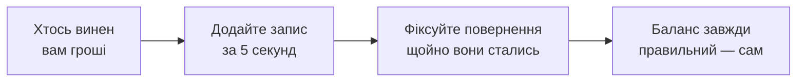

  

<h1 align="center">DebtTracker</h1>

  <b>Застосунок, який пам'ятає, хто кому винен — щоб цього не робила ваша дружба.</b> 
  «Поверну на наступному тижні» — сказано у 2019. Ми досі пам'ятаємо.

  <a href="https://bobadronov.github.io/debt-tracker/" target="_blank" rel="noopener noreferrer"><b>▶ Спробувати просто в браузері</b></a> · нічого не треба встановлювати

  
  
  
  

  <a href="README.MD">English</a> ·
  <b>Українська</b> ·
  <a href="README.de.md">Deutsch</a> ·
  <a href="README.es.md">Español</a> ·
  <a href="README.fr.md">Français</a> ·
  <a href="README.it.md">Italiano</a> ·
  <a href="README.nl.md">Nederlands</a> ·
  <a href="README.pl.md">Polski</a> ·
  <a href="README.pt.md">Português</a> ·
  <a href="README.cs.md">Čeština</a>

---

## 💸 Проблема

Ви позичили другу на обід. Він позичив вам на таксі. Брат винен вам ще з
минулого місяця, а ви винні сусідові за дриль. Десь у цьому хаосі є правда —
і точно не у вас у голові.

**DebtTracker веде рахунок, щоб ніхто не мусив вдавати, що забув.**

---

## ✨ Чому вам сподобається

### 🔀 Два списки, які ніколи не плутаються
**«Мені винні»** та **«Я винен»** живуть поруч, кожен зі своєю поточною сумою.
Одна людина може бути в обох — ми ніколи тихцем не згортаємо одне в інше. Ваш
бухгалтер, може, і заплаче. Дружба — ні.

### 📴 Спочатку офлайн, хмара — за бажанням
Кожен запис зберігається на телефоні **миттєво**, у режимі польоту чи ні.
Хочете те саме на планшеті й ноутбуці? Увійдіть — і все синхронізується в
реальному часі. Не хочете акаунт? То й не заводьте. Застосунку байдуже.

### 🧾 Кожна позика й повернення — під контролем
Запишіть €50, які позичили, потім €20, які повернули, потім ще €30. Баланс
оновлюється сам. З кольоровим кодуванням — одразу видно, хто попереду.

### 📸 Додавайте людей через QR-код
Наведіть камеру на QR-код друга в DebtTracker — і його ім'я, телефон та фото
заповняться самі. Вбивати контакти вручну — це якось *дуже* 2010-ті.

### 🔒 Під замком
Відбиток пальця, розблокування обличчям або PIN — щоразу, коли відкриваєте
застосунок. Кому й скільки ви позичили — нікого більше не стосується.

### 📊 Статистика, яка трохи коле
Загальні суми в обидва боки, ваші топ-боржники й кредитори та графік тренду
за 6 місяців. Ідеально для новорічних обіцянок.

### 📤 Експорт у CSV або PDF
Відфільтруйте за напрямком і датами, натисніть «експорт» — готово. Для
податкової, для чеків або для того друга, який запевняє: «такого не було».

### 🏠 Віджет на головному екрані
Обидві поточні суми — прямо на головному екрані Android. Це число або
мотивує, або жахає. Вирішувати вам.

### 🌍 Говорить вашою мовою
Системна · Українська · English · Deutsch · Español · Français · Italiano ·
Nederlands · Polski · Português · Čeština — перемикання миттєве, без
перезапуску.

А ще пошук, сортування, фільтри, свайп для видалення, приємні звуки та
клавіатурні скорочення на Desktop для просунутих.

---

## 🚀 Як це працює

---

## 📥 Завантажити

| Де | Посилання |
|---|---|
| 🌐 **Веб** — нічого не встановлювати (безкоштовний акаунт) | **[bobadronov.github.io/debt-tracker](https://bobadronov.github.io/debt-tracker/)** |
| 🤖 **Android** | [Google Play](https://play.google.com/store/apps/details?id=org.bigblackowl.debttracker.androidApp) |
| 🖥️ **Windows** (MSI) | [Останній реліз](https://github.com/bobadronov/debt-tracker/releases/latest) |
| 🐧 **Linux** (DEB) | [Останній реліз](https://github.com/bobadronov/debt-tracker/releases/latest) |
| 🍏 **iOS** | Збірка з коду |

---

## 🔐 Ваші дані — ваші правила

Без реклами. Без трекерів. Без аналітичних SDK. Нічого не залишає ваш
пристрій, доки **ви** самі не створите акаунт для синхронізації — і навіть
тоді це лише ваші дані, тільки ваші, зашифровані під час передавання.
Видалити все можна в налаштуваннях будь-коли.

---

## 💬 Ідеї та помилки

Чогось бракує? Щось зламалося? **Налаштування → Надіслати відгук** відкриває
коротку форму, що потрапляє одразу до розробника — знімки екрана вітаються.

---

Зроблено для тих, хто любить і свою дружбу, <i>і</i> свої гроші.

